# Entity Relationship Diagram (ERD)

## Database Schema Overview

**Database**: PostgreSQL 15+  
**ID Strategy**: UUID v7 for distributed entities, Auto-increment for internal/analytics  
**Timezone**: UTC for all timestamps  
**Delete Strategy**: Soft deletes for audit trail, hard deletes for temporary data

This ERD represents the complete database schema for the Trading Platform, covering trading operations, bot management, market data, risk management, and user configurations.

## Mermaid ERD Diagram

```mermaid
erDiagram
    Users ||--o{ Bots : owns
    Users ||--o{ Strategies : creates
    Users ||--o{ Orders : places
    Users ||--o{ Positions : holds
    Users ||--o{ API_Connections : configures
    Users ||--o{ Database_Configs : configures
    Users ||--o{ Alerts : sets
    Users ||--o{ Risk_Limits : defines
    
    Exchanges ||--o{ API_Connections : connects_to
    Exchanges ||--o{ Symbols : lists
    Exchanges ||--o{ Orders : executed_on
    Exchanges ||--o{ Positions : opened_on
    
    Bots }o--|| Strategies : uses
    Bots ||--o{ Backtests : runs
    Bots ||--o{ Risk_Limits : has
    Bots ||--o{ Bot_Performance : tracks
    
    Strategies ||--o{ Backtests : tested_with
    
    Orders }o--o| Positions : opens_closes
    Positions ||--o{ Trades : generates
    
    Symbols ||--o{ Orders : traded_in
    Symbols ||--o{ Positions : traded_in
    Symbols ||--o{ Market_Prices : has_prices
    Symbols ||--o{ OrderBook_Snapshots : has_orderbook
    Symbols ||--o{ Alerts : monitored_by

    Users {
        uuid id PK "UUID v7"
        string email UK
        string password_hash
        string full_name
        string timezone "Default: UTC"
        timestamptz created_at
        timestamptz last_login
        boolean is_active
        jsonb preferences
        timestamptz deleted_at "Soft delete"
    }

    Exchanges {
        serial id PK "Auto-increment"
        string code UK "BINANCE, BYBIT, OKX"
        string name
        string api_base_url
        jsonb supported_features "futures, spot, margin"
        boolean is_active
        jsonb rate_limits
        timestamptz created_at
        timestamptz updated_at
    }

    Bots {
        uuid id PK "UUID v7"
        uuid user_id FK
        uuid strategy_id FK
        string name
        string status "running, stopped, error, paused"
        jsonb config
        jsonb performance_stats
        timestamptz created_at
        timestamptz updated_at
        timestamptz last_run_at
        timestamptz deleted_at "Soft delete"
    }

    Strategies {
        uuid id PK "UUID v7"
        uuid user_id FK
        string name
        string type "technical, ml, hybrid, arbitrage"
        jsonb parameters
        text description
        string version "Semantic versioning"
        jsonb backtest_summary
        boolean is_public
        timestamptz created_at
        timestamptz updated_at
        timestamptz deleted_at "Soft delete"
    }

    Orders {
        uuid id PK "UUID v7"
        uuid user_id FK
        uuid position_id FK "Nullable"
        uuid bot_id FK "Nullable"
        serial exchange_id FK
        string symbol
        string side "LONG, SHORT"
        string order_type "MARKET, LIMIT, STOP_MARKET, STOP_LIMIT, TRAILING_STOP"
        decimal quantity "20,8"
        decimal price "20,8"
        decimal stop_price "20,8"
        decimal callback_rate "5,2"
        integer leverage "1-125"
        string margin_mode "ISOLATED, CROSS"
        string position_mode "ONE_WAY, HEDGE"
        string time_in_force "GTC, IOC, FOK, GTX"
        decimal stop_loss "20,8"
        decimal take_profit "20,8"
        string status "PENDING, PARTIALLY_FILLED, FILLED, CANCELLED, REJECTED, EXPIRED"
        string exchange_order_id UK
        jsonb metadata
        timestamptz created_at
        timestamptz filled_at
        timestamptz cancelled_at
        timestamptz deleted_at "Soft delete - regulatory"
    }

    Positions {
        uuid id PK "UUID v7"
        uuid user_id FK
        uuid bot_id FK "Nullable"
        serial exchange_id FK
        string symbol
        string side "LONG, SHORT"
        decimal entry_price "20,8"
        decimal mark_price "20,8"
        decimal liquidation_price "20,8"
        decimal quantity "20,8"
        decimal pnl "20,8"
        decimal pnl_percent "10,4"
        decimal unrealized_pnl "20,8"
        decimal realized_pnl "20,8"
        decimal stop_loss "20,8"
        decimal take_profit "20,8"
        integer leverage
        string margin_mode
        decimal margin_used "20,8"
        string status "OPEN, CLOSED, LIQUIDATED"
        timestamptz opened_at
        timestamptz closed_at
        timestamptz updated_at
        timestamptz deleted_at "Soft delete - audit"
    }

    Trades {
        uuid id PK "UUID v7"
        uuid position_id FK
        uuid order_id FK
        serial exchange_id FK
        string symbol
        string side "BUY, SELL"
        decimal price "20,8"
        decimal quantity "20,8"
        decimal fee "20,8"
        string fee_currency
        decimal pnl "20,8"
        string status "SUCCESS, FAILED"
        string exchange_trade_id UK
        jsonb metadata
        timestamptz executed_at
    }

    Backtests {
        uuid id PK "UUID v7"
        uuid strategy_id FK
        uuid bot_id FK "Nullable"
        string symbol
        string timeframe "1m, 5m, 15m, 1h, 4h, 1d"
        date start_date
        date end_date
        decimal initial_capital "20,8"
        decimal final_equity "20,8"
        integer total_trades
        integer winning_trades
        integer losing_trades
        decimal win_rate "5,2"
        decimal sharpe_ratio "10,4"
        decimal sortino_ratio "10,4"
        decimal max_drawdown "10,4"
        decimal max_drawdown_duration_hours
        decimal profit_factor "10,4"
        decimal avg_win "20,8"
        decimal avg_loss "20,8"
        decimal largest_win "20,8"
        decimal largest_loss "20,8"
        jsonb results "Detailed trade list"
        jsonb equity_curve "Time-series"
        jsonb metrics "Extended metrics"
        timestamptz created_at
        timestamptz deleted_at "Soft delete"
    }

    API_Connections {
        uuid id PK "UUID v7"
        uuid user_id FK
        serial exchange_id FK
        string environment "TESTNET, PRODUCTION"
        text api_key_encrypted "Fernet encryption"
        text api_secret_encrypted
        text passphrase_encrypted "For OKX, etc"
        string status "ACTIVE, INACTIVE, ERROR, EXPIRED"
        jsonb permissions "READ, TRADE, WITHDRAW"
        timestamptz last_tested_at
        jsonb last_test_result
        timestamptz created_at
        timestamptz updated_at
        timestamptz deleted_at "Soft delete"
    }

    Database_Configs {
        uuid id PK "UUID v7"
        uuid user_id FK
        string name "User-friendly name"
        string db_type "POSTGRESQL, MYSQL, MONGODB"
        string host
        integer port
        string database
        string user
        text password_encrypted "Fernet encryption"
        jsonb ssl_config
        string status "ACTIVE, INACTIVE, ERROR"
        timestamptz last_tested_at
        jsonb last_test_result
        timestamptz created_at
        timestamptz updated_at
        timestamptz deleted_at "Soft delete"
    }

    Symbols {
        string symbol PK "BTCUSDT"
        serial exchange_id FK
        string base_currency "BTC"
        string quote_currency "USDT"
        decimal min_quantity "20,8"
        decimal max_quantity "20,8"
        decimal tick_size "20,8"
        integer price_precision
        integer quantity_precision
        decimal min_notional "20,8"
        string status "TRADING, HALT, DELISTED"
        jsonb contract_info "For futures: funding_rate, etc"
        jsonb metadata
        timestamptz updated_at
    }

    Market_Prices {
        bigserial id PK "Auto-increment for analytics"
        string symbol FK
        serial exchange_id FK
        timestamptz timestamp
        string interval "1m, 5m, 15m, 30m, 1h, 4h, 1d, 1w"
        decimal open "20,8"
        decimal high "20,8"
        decimal low "20,8"
        decimal close "20,8"
        decimal volume "20,8"
        bigint trades_count
        decimal taker_buy_volume "20,8"
        decimal taker_buy_quote_volume "20,8"
    }

    OrderBook_Snapshots {
        bigserial id PK "Auto-increment"
        string symbol FK
        serial exchange_id FK
        timestamptz timestamp
        jsonb bids "[[price, quantity], ...]"
        jsonb asks "[[price, quantity], ...]"
        integer depth "5, 10, 20, 50"
        decimal total_bid_volume "20,8"
        decimal total_ask_volume "20,8"
    }

    Risk_Limits {
        uuid id PK "UUID v7"
        uuid user_id FK
        uuid bot_id FK "Nullable - global if null"
        decimal max_position_size "20,8"
        integer max_leverage
        decimal max_daily_loss "20,8"
        decimal max_drawdown "10,4"
        integer max_open_positions
        decimal max_order_size "20,8"
        jsonb risk_rules "Custom rules JSON"
        boolean enabled
        timestamptz created_at
        timestamptz updated_at
        timestamptz deleted_at "Soft delete"
    }

    Alerts {
        uuid id PK "UUID v7"
        uuid user_id FK
        string symbol FK "Nullable for system alerts"
        serial exchange_id FK "Nullable"
        string type "PRICE, PNL, RISK, SYSTEM, FUNDING_RATE"
        jsonb condition "Comparison logic"
        decimal threshold "20,8"
        string status "ACTIVE, TRIGGERED, DISABLED, EXPIRED"
        string notification_channel "EMAIL, TELEGRAM, WEBHOOK, SMS"
        jsonb notification_config "Channel-specific config"
        jsonb metadata
        timestamptz triggered_at
        timestamptz created_at
        timestamptz updated_at
        timestamptz expires_at "Auto-disable after"
    }

    Bot_Performance {
        bigserial id PK "Auto-increment for analytics"
        uuid bot_id FK
        date date UK
        decimal daily_pnl "20,8"
        decimal cumulative_pnl "20,8"
        integer trades_count
        integer winning_trades
        integer losing_trades
        decimal win_rate "5,2"
        decimal sharpe_ratio "10,4"
        decimal max_drawdown "10,4"
        decimal total_volume "20,8"
        decimal total_fees "20,8"
        jsonb detailed_metrics "Per-symbol breakdown"
        timestamptz created_at
    }

    Event_Queue {
        bigserial id PK "Auto-increment"
        uuid event_id UK "UUID v7 for deduplication"
        string event_type "ORDER_FILLED, POSITION_OPENED, ALERT_TRIGGERED"
        jsonb payload
        string status "PENDING, PROCESSING, COMPLETED, FAILED"
        integer retry_count
        timestamptz created_at
        timestamptz processed_at
        timestamptz expires_at "TTL for cleanup"
    }
```



---

## Tables Description

### Core Tables

#### Users
- **ID Strategy**: UUID v7 (distributed auth)
- **Soft Delete**: Yes (regulatory compliance)
- **Key Fields**: email (unique), password_hash (bcrypt), timezone (default UTC)
- **Indexes**: email, created_at, deleted_at

#### Exchanges
- **ID Strategy**: Auto-increment (internal reference)
- **Purpose**: Supported exchange configurations
- **Key Fields**: code (BINANCE, BYBIT, OKX), supported_features
- **No Soft Delete**: Static configuration data

#### Bots
- **ID Strategy**: UUID v7 (distributed system)
- **Soft Delete**: Yes (user data, history)
- **Key Fields**: status, config (strategy parameters)
- **Indexes**: user_id, status, last_run_at, deleted_at

#### Strategies
- **ID Strategy**: UUID v7 (sharable across services)
- **Soft Delete**: Yes (versioning, marketplace)
- **Key Fields**: type, parameters (JSON), version (semantic)
- **Indexes**: user_id, type, is_public, deleted_at

### Trading Tables

#### Orders
- **ID Strategy**: UUID v7 (distributed trading system)
- **Soft Delete**: Yes (regulatory audit trail)
- **Key Fields**: exchange_id, side, order_type, status
- **Indexes**: 
  - (user_id, symbol, exchange_id, created_at)
  - (status, created_at)
  - exchange_order_id (unique)
  - deleted_at
- **Partitioning**: By created_at (monthly)

#### Positions
- **ID Strategy**: UUID v7 (distributed)
- **Soft Delete**: Yes (audit trail, tax reporting)
- **Key Fields**: exchange_id, entry_price, pnl, liquidation_price
- **Indexes**: 
  - (user_id, symbol, exchange_id, status)
  - (bot_id, opened_at)
  - deleted_at
- **Partitioning**: By opened_at (quarterly)

#### Trades
- **ID Strategy**: UUID v7 (distributed, event sourcing)
- **No Soft Delete**: Immutable audit trail
- **Key Fields**: exchange_trade_id (unique), executed_at
- **Indexes**: (position_id, executed_at), exchange_trade_id
- **Partitioning**: By executed_at (monthly)

### Market Data Tables

#### Symbols
- **ID Strategy**: Natural key (symbol as PK)
- **No Soft Delete**: Reference data, use status field
- **Key Fields**: exchange_id, status (TRADING/HALT/DELISTED)
- **Indexes**: (exchange_id, status)

#### Market_Prices
- **ID Strategy**: Auto-increment (high-performance analytics)
- **No Soft Delete**: Time-series data, use retention policy
- **Key Fields**: interval, timestamp
- **Indexes**: 
  - (symbol, exchange_id, interval, timestamp DESC) - unique
- **Partitioning**: By timestamp (weekly for 1m/5m, monthly for others)
- **Retention**: 
  - 1m: 30 days
  - 5m/15m: 90 days
  - 1h+: 5 years

#### OrderBook_Snapshots
- **ID Strategy**: Auto-increment (high-frequency writes)
- **No Soft Delete**: Derived data, short retention
- **Indexes**: (symbol, exchange_id, timestamp)
- **Partitioning**: By timestamp (daily)
- **Retention**: 7-30 days

### Analysis Tables

#### Backtests
- **ID Strategy**: UUID v7 (sharable results)
- **Soft Delete**: Yes (user may want to restore)
- **Key Fields**: results (JSON), equity_curve (time-series)
- **Indexes**: (strategy_id, created_at), (bot_id, created_at), deleted_at

#### Bot_Performance
- **ID Strategy**: Auto-increment (analytics, aggregation)
- **No Soft Delete**: Derived data, can be recalculated
- **Key Fields**: date (unique per bot), cumulative_pnl
- **Indexes**: (bot_id, date) - unique
- **Partitioning**: By date (quarterly)

### Configuration Tables

#### API_Connections
- **ID Strategy**: UUID v7 (distributed credential management)
- **Soft Delete**: Yes (user may reconnect)
- **Security**: All credentials encrypted with Fernet
- **Indexes**: (user_id, exchange_id), deleted_at

#### Database_Configs
- **ID Strategy**: UUID v7
- **Soft Delete**: Yes (may reconnect)
- **Security**: Password encrypted with Fernet
- **Indexes**: user_id, deleted_at

### Risk Management Tables

#### Risk_Limits
- **ID Strategy**: UUID v7
- **Soft Delete**: Yes (risk rule history)
- **Key Fields**: max_position_size, max_leverage, risk_rules (JSON)
- **Indexes**: (user_id, bot_id), deleted_at

#### Alerts
- **ID Strategy**: UUID v7
- **No Soft Delete**: Use status field (triggered alerts stay)
- **Key Fields**: type, condition (JSON), status
- **Indexes**: (user_id, symbol, status), (status, created_at)
- **TTL**: expires_at for auto-cleanup

### Queue Tables

#### Event_Queue
- **ID Strategy**: Auto-increment (high-performance queue)
- **UUID**: event_id (UUID v7) for deduplication
- **No Soft Delete**: Use expires_at for TTL cleanup
- **Purpose**: Event-driven architecture (order fills, alerts, etc.)
- **Indexes**: (status, created_at), event_id (unique)

---

## Data Types & Precision

```sql
-- IDs
uuid                    -- UUID v7 for distributed entities
serial                  -- Auto-increment for internal/analytics
bigserial               -- Auto-increment for high-volume tables

-- Numeric
DECIMAL(20,8)           -- Prices, quantities, PnL
DECIMAL(10,4)           -- Ratios, percentages
DECIMAL(5,2)            -- Win rate, callback rate

-- Text
VARCHAR(255)            -- Standard strings
TEXT                    -- Long content (encrypted data, descriptions)

-- JSON
JSONB                   -- Structured data (PostgreSQL native)

-- Time
TIMESTAMPTZ             -- All timestamps in UTC
DATE                    -- Date-only fields
```

## Indexes Strategy

### Composite Indexes (High Priority)

```sql
-- Orders - Most frequent queries
CREATE INDEX idx_orders_user_symbol_exchange 
  ON orders(user_id, symbol, exchange_id, created_at DESC) 
  WHERE deleted_at IS NULL;

CREATE INDEX idx_orders_status_time 
  ON orders(status, created_at DESC) 
  WHERE deleted_at IS NULL;

-- Positions - Active positions query
CREATE INDEX idx_positions_user_open 
  ON positions(user_id, status, opened_at DESC) 
  WHERE deleted_at IS NULL AND status = 'OPEN';

-- Market Prices - Time-series queries
CREATE UNIQUE INDEX idx_market_prices_symbol_interval_time 
  ON market_prices(symbol, exchange_id, interval, timestamp DESC);

-- Soft Delete Indexes
CREATE INDEX idx_users_deleted ON users(deleted_at) WHERE deleted_at IS NOT NULL;
CREATE INDEX idx_bots_deleted ON bots(deleted_at) WHERE deleted_at IS NOT NULL;
CREATE INDEX idx_orders_deleted ON orders(deleted_at) WHERE deleted_at IS NOT NULL;
CREATE INDEX idx_positions_deleted ON positions(deleted_at) WHERE deleted_at IS NOT NULL;
```

### Partial Indexes (Optimization)

```sql
-- Active bots only
CREATE INDEX idx_bots_active 
  ON bots(user_id, last_run_at DESC) 
  WHERE deleted_at IS NULL AND status IN ('running', 'paused');

-- Pending orders only
CREATE INDEX idx_orders_pending 
  ON orders(user_id, created_at DESC) 
  WHERE deleted_at IS NULL AND status = 'PENDING';

-- Active alerts only
CREATE INDEX idx_alerts_active 
  ON alerts(user_id, symbol, type) 
  WHERE status = 'ACTIVE' AND expires_at > NOW();
```

## Partitioning Strategy (PostgreSQL)

### Time-Series Partitioning

```sql
-- Market Prices (1m/5m data - weekly partitions)
CREATE TABLE market_prices (
    id BIGSERIAL,
    symbol VARCHAR(20) NOT NULL,
    exchange_id INTEGER NOT NULL,
    timestamp TIMESTAMPTZ NOT NULL,
    interval VARCHAR(10) NOT NULL,
    -- OHLCV fields
    PRIMARY KEY (id, timestamp)
) PARTITION BY RANGE (timestamp);

-- Create partitions automatically
CREATE TABLE market_prices_2025_w50 PARTITION OF market_prices
    FOR VALUES FROM ('2025-12-09') TO ('2025-12-16');

-- Orders (monthly partitions)
CREATE TABLE orders (
    id UUID PRIMARY KEY,
    -- fields
    created_at TIMESTAMPTZ NOT NULL
) PARTITION BY RANGE (created_at);

CREATE TABLE orders_2025_12 PARTITION OF orders
    FOR VALUES FROM ('2025-12-01') TO ('2026-01-01');
```

### Partition Management

```sql
-- Auto-create partitions (pg_partman extension)
SELECT partman.create_parent(
    'public.market_prices',
    'timestamp',
    'native',
    'weekly',
    p_premake := 4
);

-- Auto-drop old partitions (retention policy)
UPDATE partman.part_config 
SET retention_keep_table = false,
    retention_keep_index = false,
    retention_interval = '30 days'
WHERE parent_table = 'public.market_prices';
```

## Soft Delete Implementation

### Database Level

```sql
-- Add deleted_at column
ALTER TABLE users ADD COLUMN deleted_at TIMESTAMPTZ;
ALTER TABLE bots ADD COLUMN deleted_at TIMESTAMPTZ;
-- ... for applicable tables

-- Create partial indexes
CREATE INDEX idx_users_active ON users(id) WHERE deleted_at IS NULL;
CREATE INDEX idx_bots_active ON bots(id) WHERE deleted_at IS NULL;

-- Views for active records (optional)
CREATE VIEW active_users AS 
  SELECT * FROM users WHERE deleted_at IS NULL;

CREATE VIEW active_bots AS 
  SELECT * FROM bots WHERE deleted_at IS NULL;
```

### Application Level (SQLAlchemy)

```python
from sqlalchemy import Column, DateTime
from datetime import datetime

class SoftDeleteMixin:
    deleted_at = Column(DateTime(timezone=True), nullable=True, index=True)
    
    def soft_delete(self):
        self.deleted_at = datetime.utcnow()
    
    def restore(self):
        self.deleted_at = None
    
    @classmethod
    def active_query(cls, query):
        return query.filter(cls.deleted_at.is_(None))
```

## Data Retention & Cleanup

### Automated Cleanup Jobs

```sql
-- Delete old event queue (hard delete after processing)
DELETE FROM event_queue 
WHERE status = 'COMPLETED' 
  AND processed_at < NOW() - INTERVAL '7 days';

DELETE FROM event_queue 
WHERE expires_at < NOW();

-- Delete old orderbook snapshots (hard delete)
DELETE FROM orderbook_snapshots 
WHERE timestamp < NOW() - INTERVAL '30 days';

-- Delete old 1m/5m market prices (hard delete)
DELETE FROM market_prices 
WHERE interval IN ('1m', '5m') 
  AND timestamp < NOW() - INTERVAL '30 days';

DELETE FROM market_prices 
WHERE interval = '15m' 
  AND timestamp < NOW() - INTERVAL '90 days';

-- Cleanup triggered alerts (soft delete -> hard delete)
DELETE FROM alerts 
WHERE deleted_at < NOW() - INTERVAL '1 year';
```

### Retention Policy Table

| Table | Soft Delete | Hard Delete After | Cleanup Job |
|-------|-------------|-------------------|-------------|
| users | Yes | Never (GDPR: on request) | Manual |
| bots | Yes | Never | Manual |
| strategies | Yes | Never | Manual |
| orders | Yes | 7 years (tax law) | Annual |
| positions | Yes | 7 years | Annual |
| trades | No | Never | - |
| backtests | Yes | 1 year after soft delete | Monthly |
| api_connections | Yes | 1 year after soft delete | Monthly |
| risk_limits | Yes | 1 year after soft delete | Monthly |
| alerts | No | Immediate (status=DISABLED) | Daily |
| market_prices | No | By interval (30d-5y) | Daily |
| orderbook_snapshots | No | 30 days | Daily |
| event_queue | No | 7 days after completion | Hourly |
| bot_performance | No | Never | - |

## Security Implementation

### Encryption (Application Level)

```python
from cryptography.fernet import Fernet
import os

# Generate key (store in env variable)
ENCRYPTION_KEY = os.environ['FERNET_KEY']
cipher = Fernet(ENCRYPTION_KEY)

def encrypt_api_key(api_key: str) -> str:
    return cipher.encrypt(api_key.encode()).decode()

def decrypt_api_key(encrypted: str) -> str:
    return cipher.decrypt(encrypted.encode()).decode()
```

### Row-Level Security (PostgreSQL)

```sql
-- Enable RLS on tables
ALTER TABLE orders ENABLE ROW LEVEL SECURITY;
ALTER TABLE positions ENABLE ROW LEVEL SECURITY;
ALTER TABLE bots ENABLE ROW LEVEL SECURITY;

-- Policy: Users can only see their own data
CREATE POLICY user_isolation ON orders
    FOR ALL
    USING (user_id = current_setting('app.user_id')::uuid);

CREATE POLICY user_isolation ON positions
    FOR ALL
    USING (user_id = current_setting('app.user_id')::uuid);

-- Set user context in application
-- SET SESSION app.user_id = '{user_uuid}';
```

## Migration Plan

### Phase 1: Core Setup (Week 1)
```sql
1. Create database and extensions
   - UUID-OSSP for UUID v7
   - pg_partman for partition management
   - pgcrypto for encryption helpers

2. Create core tables
   - users, exchanges, symbols

3. Create configuration tables
   - api_connections, database_configs
```

### Phase 2: Trading Tables (Week 1-2)
```sql
4. Create trading tables with partitioning
   - orders (monthly partitions)
   - positions (quarterly partitions)
   - trades (monthly partitions)

5. Create indexes and constraints
```

### Phase 3: Bot & Analytics (Week 2)
```sql
6. Create bot/strategy tables
   - bots, strategies, backtests

7. Create analytics tables
   - bot_performance (quarterly partitions)
```

### Phase 4: Market Data (Week 2-3)
```sql
8. Create time-series tables with partitioning
   - market_prices (weekly/monthly partitions)
   - orderbook_snapshots (daily partitions)

9. Setup retention policies
```

### Phase 5: Auxiliary Tables (Week 3)
```sql
10. Create supporting tables
    - risk_limits, alerts, event_queue

11. Setup RLS policies
12. Create views for active records
```

---

## Alembic Migration Commands

```bash
# Initialize Alembic
alembic init migrations

# Create migration
alembic revision --autogenerate -m "Create core tables"

# Apply migration
alembic upgrade head

# Rollback
alembic downgrade -1
```

---

## Confirmed Decisions

✅ **Database**: PostgreSQL 15+  
✅ **ID Strategy**: 
- UUID v7 for distributed entities (Orders, Positions, Trades, Bots, Users...)
- Auto-increment for internal/analytics (Market_Prices, Bot_Performance, Event_Queue, Exchanges)

✅ **Soft Deletes**: 
- **YES** for: Users, Bots, Strategies, Orders, Positions, Backtests, API_Connections, Database_Configs, Risk_Limits
- **NO** for: Trades (immutable), Market_Prices (time-series), Symbols (use status), Alerts (use status), Event_Queue (TTL)

✅ **Multi-Exchange**: Yes - `exchange_id` FK in Orders, Positions, Trades, Symbols, Market_Prices  
✅ **Timezone**: UTC for all timestamps  
✅ **Encryption**: Fernet for API keys/secrets  
✅ **Partitioning**: Time-based for high-volume tables

---

## Next Steps (Pending Review)

**NOT YET GENERATED** - Waiting for additional confirmations:

- [ ] SQL migration scripts (Alembic)
- [ ] SQLAlchemy models with mixins
- [ ] TypeScript types for frontend
- [ ] Seed data for development
- [ ] Database setup scripts
- [ ] Backup & recovery procedures

**Questions Still Open:**

1. **Currency**: Store prices in quote currency (USDT) or base currency (BTC)?
2. **Leverage**: Per-position leverage or account-level default?
3. **Historical Data**: How far back do we need candlestick data for backtesting?
4. **Funding Rate**: Track funding rate history for futures? (separate table?)
5. **Trade Fees**: Track maker/taker fees separately?
6. **Position Sizing**: Max position size in base currency or quote currency?
