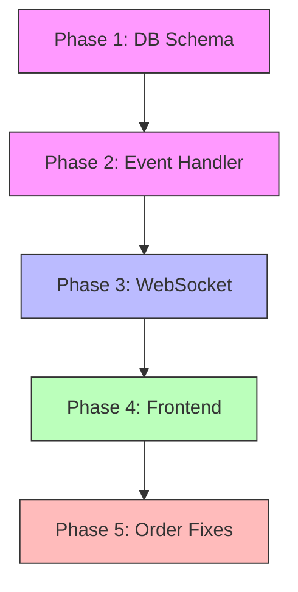

# Bot Details & Order System - Implementation Tasks

**Created:** 2025-12-25  
**Status:** Ready to implement  
**Prerequisites:** Trade = Position Close (confirmed)

---

## Overview

Tài liệu này tổng hợp các công việc cần thực hiện từ:
- [BOT_DETAILS_REVIEW.md](file:///home/qwe/Desktop/zxc/reivew/BOT_DETAILS_REVIEW.md)
- [ORDER_CAPABILITIES_REPORT.md](file:///home/qwe/Desktop/zxc/reivew/ORDER_CAPABILITIES_REPORT.md)

---

## Phase 1: Database Schema (Priority: HIGH) ✅ COMPLETE

### 1.1 Add Bot Stats Fields to `BotModel` ✅

**File:** `backend/src/trading/infrastructure/persistence/models/bot_models.py`

**Status:** ✅ **DONE** - All fields added (lines 55-65)

```python
# Fields added:
total_pnl = Column(DECIMAL(20, 8), nullable=False, default=Decimal("0"))
total_trades = Column(Integer, nullable=False, default=0)
winning_trades = Column(Integer, nullable=False, default=0)
losing_trades = Column(Integer, nullable=False, default=0)
# win_rate = computed from winning_trades / total_trades

# Streak tracking
current_win_streak = Column(Integer, nullable=False, default=0)
current_loss_streak = Column(Integer, nullable=False, default=0)
max_win_streak = Column(Integer, nullable=False, default=0)
max_loss_streak = Column(Integer, nullable=False, default=0)
```

### 1.2 Create Migration ✅

**Status:** ✅ **DONE** - Migration created at `migrations/versions/20251225_0915_add_bot_stats_fields.py`

### 1.3 Add Indexes ✅

**Status:** ✅ **DONE** - Index `idx_bots_total_pnl` created (line 24 in bot_models.py)

---

## Phase 2: Event-Driven Bot Stats Update (Priority: HIGH) ⚠️ PARTIAL

### 2.1 Create BotStatsService ✅

**File:** `backend/src/trading/application/services/bot_stats_service.py`

**Status:** ✅ **DONE** - Service implemented with:
- `update_stats_on_trade_close()` method
- `get_bot_stats()` method for WebSocket broadcast
- Proper win/loss streak calculation
- Win rate calculation (0-100)

### 2.2 Wire Event Handler ⚠️ ALTERNATIVE APPROACH

**Status:** ⚠️ **PARTIAL** - Instead of dedicated handler, integrated into order flow:
- Stats update triggered in `UpdateOrderStatusUseCase` (lines 60-67, 99-149)
- Called when `close_position` orders are filled
- Broadcasts stats via WebSocket after update

**Note:** This works but differs from the planned `PositionClosedEvent` handler approach. Consider creating dedicated event handler for cleaner architecture.

### 2.3 Add Bot ID to PositionClosedEvent ✅

**File:** `backend/src/trading/domain/portfolio/events/position_closed_event.py`

**Status:** ✅ **DONE** - `bot_id: Optional[str] = None` field added (line 35)

---

## Phase 3: WebSocket Real-time Updates (Priority: HIGH) ✅ COMPLETE

### 3.1 Add `broadcast_bot_stats_update` Method ✅

**File:** `backend/src/trading/infrastructure/websocket/websocket_manager.py`

**Status:** ✅ **DONE** - Method implemented (lines 268-293) with:
- Proper StreamMessage construction
- Bot stats data propagation
- User-specific broadcast
- Error handling and logging

### 3.2 Add `BOT_STATS` to StreamType Enum ✅

**File:** `backend/src/trading/infrastructure/websocket/connection_manager.py`

**Status:** ✅ **DONE** - `BOT_STATS = "BOT_STATS"` added to StreamType enum (line 18)

---

## Phase 4: Frontend Real-time Integration (Priority: MEDIUM) ✅ COMPLETE

### 4.1 Create useBotStatsWebSocket Hook ✅

**File:** `frontend/src/hooks/use-bot-stats-websocket.ts`

**Status:** ✅ **DONE** - Implemented with:
- WebSocket connection management
- `BOT_STATS` stream subscription
- Auto-reconnect logic
- Connection state tracking
- `parseBotStats()` helper for safe number parsing

### 4.2 Update Bot Type with Streak Fields ✅

**File:** `frontend/src/lib/types/bot.ts`

**Status:** ✅ **DONE** - All streak fields added (lines 53-58):
- `current_win_streak?: number;`
- `current_loss_streak?: number;`
- `max_win_streak?: number;`
- `max_loss_streak?: number;`

### 4.3 Update BotDetail.tsx ✅

**File:** `frontend/src/pages/BotDetail.tsx`

**Status:** ✅ **DONE** - Full implementation:
- ✅ Removed mock data for stats (still uses mock for positions/orders)
- ✅ Subscribed to `bot_stats` stream via `useBotStatsWebSocket` hook (lines 107-117)
- ✅ Updates state when WS message received (line 109-111)
- ✅ Added Streak card to UI (lines 343-361)
- ✅ Shows WebSocket connection indicator (lines 312-317)
- ✅ Displays real-time stats: Total P&L, Win Rate, Trades, Streak

### 4.4 Update Bots.tsx (Bot Management) ✅

**File:** `frontend/src/pages/Bots.tsx`

**Status:** ✅ **DONE** - Displays streak data from API/store:
- ✅ Shows streak in bot cards (lines 431-444)
- ✅ Parses streak fields from bot data (lines 385-386)
- ⚠️ Note: Not subscribed to live WebSocket (displays last fetched data only)
- Consider: Adding WebSocket subscription for live updates in bot list

---

## Phase 5: Order System Improvements (Priority: LOW) ✅ COMPLETE

### 5.1 Fix Modify Order (Cancel-and-Replace) ✅

**File:** `backend/src/trading/presentation/controllers/order_controller.py`

**Status:** ✅ **DONE** - Implemented cancel-and-replace pattern
- ✅ Using `ModifyOrderUseCase` for proper exchange integration (lines 332-388)
- ✅ Cancels original order on exchange
- ✅ Creates replacement order with new params
- ✅ Links orders via metadata for traceability

**Implementation:**
- `ModifyOrderUseCase` in `use_cases/order/modify_order.py` (already existed)
- Controller wires up use case with proper dependency injection
- Returns replacement order with new ID

### 5.2 Add Missing Order Types ✅

**Files:**
- `backend/src/trading/domain/order/__init__.py`
- `backend/src/trading/application/use_cases/order/create_order.py`
- `backend/src/trading/presentation/controllers/order_controller.py`

**Status:** ✅ **DONE** - All types were already in domain/use case, added controller support
- ✅ TAKE_PROFIT factory method (existed in domain)
- ✅ TAKE_PROFIT_MARKET factory method (existed in domain)
- ✅ TRAILING_STOP_MARKET factory method (existed in domain)
- ✅ Controller now handles all types (lines 94-142 in order_controller.py)

### 5.3 Add Order Validation ✅

**File:** `backend/src/trading/application/services/order_validator.py`

**Status:** ✅ **DONE** - Created OrderValidator service
- ✅ Query exchange for symbol info (min/max qty, price/qty precision, min notional)
- ✅ Validate and adjust quantity to meet constraints
- ✅ Validate and adjust price precision
- ✅ Cache symbol info to avoid repeated API calls
- ✅ Comprehensive validation with helpful error messages

**Note:** Validator is ready for integration into CreateOrderUseCase when needed.

---

## Implementation Order



**Legend:**
- 🟣 Phase 1-2: Backend Core (do first)
- 🔵 Phase 3: WebSocket Bridge
- 🟢 Phase 4: Frontend
- 🔴 Phase 5: Order Improvements (optional for initial release)

---

## Verification Checklist

### After Phase 2:
- [x] ✅ Position close → Bot stats updated in DB (via `UpdateOrderStatusUseCase`)
- [ ] ❌ Unit test: `test_position_closed_handler.py` (not created)

### After Phase 3:
- [x] ✅ Position close → WS message sent to user (via `broadcast_bot_stats_update`)
- [x] ✅ Can subscribe to `bot_stats` stream (frontend hook implemented)

### After Phase 4:
- [x] ✅ BotDetail shows real-time stats (with WebSocket connection indicator)
- [/] ⚠️ Bot Management shows values from last fetch (no live WebSocket subscription)
- [x] ✅ Streak counters display correctly (both pages)

### After Phase 5:
- [x] ✅ Modify order actually updates on exchange (cancel-and-replace implemented)
- [x] ✅ TAKE_PROFIT orders work (controller support added)
- [x] ✅ TAKE_PROFIT_MARKET orders work (controller support added)
- [x] ✅ TRAILING_STOP_MARKET orders work (controller support added)
- [x] ✅ Order validation service created (ready for integration)

---

## Notes

1. **Trade Definition:** Trade = Position Closed (`PositionClosedEvent`)
2. **Win Rate Formula:** `winning_trades / total_trades * 100`
3. **Win Trade:** `realized_pnl > 0`
4. **Loss Trade:** `realized_pnl < 0`
5. **Streak Logic:** Reset opposite streak when trade result changes

---

## ⚠️ Lessons Learned - Tránh Bug Đã Gặp

> Từ [debugging-experience.md](file:///home/qwe/Desktop/zxc/docs/debugging-experience.md)

### Phase 1 (Database) - Tránh Các Lỗi:

| Pattern | Vấn đề | Cách tránh |
|---------|--------|------------|
| **#13: DECIMAL Overflow** | DECIMAL(10,4) không chứa được số quá lớn | Dùng `DECIMAL(20,8)` cho `total_pnl`, clamp values trước khi save |
| **#19: Timezone Mismatch** | DateTime naive vs aware | Dùng `DateTime(timezone=True)` cho tất cả timestamp columns |
| **#12: Missing Field Default** | NULL error khi insert | Luôn có `default=0` hoặc `default=Decimal("0")` cho mọi field |

```python
# ✅ GOOD - Phase 1 pattern
total_pnl = Column(DECIMAL(20, 8), nullable=False, default=Decimal("0"))
current_win_streak = Column(Integer, nullable=False, default=0)
updated_at = Column(DateTime(timezone=True), nullable=True)
```

---

### Phase 2 (Event Handler) - Tránh Các Lỗi:

| Pattern | Vấn đề | Cách tránh |
|---------|--------|------------|
| **#3: Missing Field Mapping** | Repository không map hết fields | Map TẤT CẢ fields trong `_model_to_entity()` |
| **#2: Missing Eager Loading** | Foreign key relationships bị None | Dùng `selectinload()` cho bot relationship |
| **#14: Related Table Missing** | Metrics ở table khác không load | Load cả parent và child relationships |

```python
# ✅ GOOD - Phase 2 pattern (khi load bot để update)
result = await session.execute(
    select(BotModel)
    .options(selectinload(BotModel.positions))  # Load positions
    .where(BotModel.id == bot_id)
)
```

---

### Phase 3 (WebSocket) - Tránh Các Lỗi:

| Pattern | Vấn đề | Cách tránh |
|---------|--------|------------|
| **#5: String vs Number** | DECIMAL serialize thành string trong JSON | Document rõ: API trả string, FE phải parseFloat |
| **#4: Percentage Scaling** | Double multiply 5000% thay vì 50% | `win_rate` trả về đã là percentage (0-100), KHÔNG nhân 100 |
| **#17: Timestamp String** | `.isoformat()` trên string crash | Kiểm tra type trước khi gọi method |

```python
# ✅ GOOD - Phase 3 WebSocket message format
data={
    "total_pnl": str(stats["total_pnl"]),  # String for Decimal
    "win_rate": float(stats["win_rate"]),  # Already 0-100, don't multiply
    "total_trades": int(stats["total_trades"]),  # Integer
    "timestamp": datetime.utcnow().isoformat() + "Z",  # ISO string with Z
}
```

---

### Phase 4 (Frontend) - Tránh Các Lỗi:

| Pattern | Vấn đề | Cách tránh |
|---------|--------|------------|
| **#1: .toFixed() on Null** | Crash khi giá trị null/undefined | Dùng `!= null` check + `parseFloat(String())` |
| **#15: Decimal as String** | API trả Decimal dạng string | Luôn parseFloat trước khi hiển thị |
| **#2: Missing Status Config** | Status mới không có trong config | Thêm fallback `\|\| defaultConfig` |
| **#3: useMemo Side Effects** | setState trong useMemo gây crash | Dùng useEffect cho side effects |
| **#21: Select Empty Value** | Radix Select crash với empty string | Đảm bảo Select options không có value rỗng |

```typescript
// ✅ GOOD - Phase 4 Frontend patterns

// Pattern #1, #15: Safe number display
{(bot.total_pnl != null 
    ? parseFloat(String(bot.total_pnl)) 
    : 0
).toFixed(2)}

// Pattern #4: DON'T double multiply
{bot.win_rate != null ? parseFloat(String(bot.win_rate)).toFixed(1) : 0}%
// API đã trả 50.00, KHÔNG làm * 100 = 5000%

// Pattern #2: Status config fallback
const config = statusConfig[bot.status] || { label: 'Unknown', color: 'gray' };

// Pattern #3: Side effects in useEffect
useEffect(() => {
  // Subscribe to WebSocket here
  ws.subscribe('bot_stats', handleStatsUpdate);
  return () => ws.unsubscribe('bot_stats');
}, [botId]);
```

---

### Phase 5 (Order System) - Tránh Các Lỗi:

| Pattern | Vấn đề | Cách tránh |
|---------|--------|------------|
| **#9: Date Format** | HTML date input vs API datetime | Convert `YYYY-MM-DD` → `YYYY-MM-DDTHH:mm:ss` |
| **#11: Wrong Param Names** | Frontend param khác backend | Match chính xác: `interval` không phải `timeframe` |
| **#19: Status Validation** | Bot stuck ở STARTING status | Check cả `can_be_X()` VÀ `X()` method |

---

## Pre-Implementation Checklist

### Backend Checklist:
- [ ] Tất cả DECIMAL columns dùng `(20, 8)` để tránh overflow
- [ ] Tất cả DateTime columns có `timezone=True`
- [ ] Tất cả fields có default value, không để NULL
- [ ] Repository queries có `selectinload()` cho relationships
- [ ] `_model_to_entity()` map TẤT CẢ fields
- [ ] Percentage values trả về 0-100, KHÔNG phải 0-1

### Frontend Checklist:
- [ ] Mọi số từ API được `parseFloat(String(value))` trước khi dùng
- [ ] Mọi `.toFixed()` có `!= null` check trước đó
- [ ] Status config có fallback cho unknown statuses
- [ ] Không dùng `useMemo` cho setState
- [ ] WebSocket subscription trong useEffect với cleanup

### WebSocket Message Contract:
```json
{
  "stream_type": "bot_stats",
  "data": {
    "bot_id": "uuid-string",
    "total_pnl": "1234.56789012",  // STRING (Decimal)
    "win_rate": 55.5,              // NUMBER (already 0-100)
    "total_trades": 42,            // INTEGER
    "winning_trades": 23,          // INTEGER
    "losing_trades": 19,           // INTEGER
    "current_win_streak": 3,       // INTEGER
    "current_loss_streak": 0,      // INTEGER
    "max_win_streak": 7,           // INTEGER
    "max_loss_streak": 5           // INTEGER
  },
  "timestamp": "2025-12-25T09:00:00Z"
}
```
